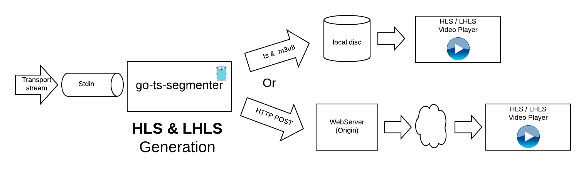

# go-ts-segmenter
This tool enables you to segment (create HLS playable chunks) a live transport stream that is read from `stdin` or from a TCP socket. It also creates in real time the the HLS manifest (the chunklist).
The output can be sent to files in local disk or pushed using HTTP to any webserver you have configured as a live streaming origin.

This segmenter also implements "periscope" [LHLS](https://medium.com/@periscopecode/introducing-lhls-media-streaming-eb6212948bef) mode. This low latency mode is used in any output type (local files and HTTP).

This code is not designed to be used in any production workflow, it has been created as a learning GoLang exercise.



# Usage
## Installation
1. Just install GO in your computer. See [GoLang](https://golang.org/), [instructions](https://golang.org/doc/install)
2. Clone this repo:
```
cd ~
go get github.com/jordicenzano/go-ts-segmenter
```
3. Go the the source code dir `
```
cd go/src/github.com/jordicenzano/go-ts-segmenter
```
4. Install the package dependencies:
```
go get
```
5. Compile `main.go` doing:
```
make
```

# Docker
## Pulling image from docker hub
1. Ensure you have [docker](https://www.docker.com) installed
2. Type: `docker pull jcenzano/docker-go-ts-segmenter`

## Creating the docker image locally
1. Ensure you have docker [docker](https://www.docker.com) and make installed
2. Type `make build_docker`

## Testing the docker image
1. You can test the image with this command (you should see the help):
```
docker run --rm -it jcenzano/docker-go-ts-segmenter
```

1. To segment TS via TCP:
```
docker run --rm -it jcenzano/docker-go-ts-segmenter
DOCKER_INTERNAL_PATH="/tmpdata"
ABS_DST_PATH=`realpath ${DST_PATH}`
docker run -i -t -d --rm -p 2002:2002 -v /myLocalOutputDir:/tmpdata jcenzano/docker-go-ts-segmenter:latest -inputType 2 -dstPath /tmpdata -chunksBaseFilename source_ -chunklistFilename source.m3u8

```

# Testing
You can execute `bin/go-ts-segmenter -h` to see all the possible command arguments.
```
Usage of ./bin/go-ts-segmenter:
  -apid int
        Audio PID to parse (default -1)
  -apids
        Enable auto PID detection, if true no need to pass vpid and apid (default true)
  -chunklistFilename string
        Chunklist filename (default "chunklist.m3u8")
  -chunksBaseFilename string
        Chunks base filename (default "chunk_")
  -dstPath string
        Output path (default "./results")
  -host string
        HTTP Host (default "localhost:9094")
  -httpMaxRetries int
        Max retries for HTTP service unavailable (default 40)
  -initType int
        Indicates where to put the init data PAT and PMT packets (0- No ini data, 1- Init segment, 2- At the beginning of each chunk (default 2)
  -initialHTTPRetryDelay int
        Initial retry delay in MS for chunk HTTP (no chunk transfer) uploads. Value = intent * initialHttpRetryDelay (default 5)
  -inputType int
        Where gets the input data (1-stdin, 2-TCP socket) (default 1)
  -insecure
        Skips CA verification for HTTPS
  -lhls int
        If > 0 activates LHLS, and it indicates the number of advanced chunks to create
  -liveWindowSize int
        Live window size in chunks (default 3)
  -localPort int
        Local port to listen in case inputType = 2 (default 2002)
  -logsPath string
        Logs file path
  -manifestDestinationType int
        Indicates where the destination (0- No output, 1- File + flag indicator, 2- HTTP) (default 1)
  -manifestType int
        Manifest to generate (0- Vod, 1- Live event, 2- Live sliding window (default 2)
  -mediaDestinationType int
        Indicates where the destination (0- No output, 1- File + flag indicator, 2- HTTP chunked transfer, 3- HTTP regular) (default 1)
  -protocol string
        HTTP Scheme (http, https) (default "http")
  -targetDur float
        Target chunk duration in seconds (default 4)
  -verbose
        enable to get verbose logging
  -vpid int
        Video PID to parse (default -1)
```
## Examples output to disc
- Generate simple HLS from a test VOD TS file in `./results/vod`:
```
cat ./fixture/testSmall.ts| bin/go-ts-segmenter -dstPath ./results/vod
```

- Generate simple HLS from a test **live** stream in `./results/live` (requires [ffmpeg](https://ffmpeg.org/)):
```
ffmpeg -f lavfi -re -i smptebars=duration=20:size=320x200:rate=30 -f lavfi -i sine=frequency=1000:duration=20:sample_rate=48000 -pix_fmt yuv420p -c:v libx264 -b:v 180k -g 60 -keyint_min 60 -profile:v baseline -preset veryfast -c:a aac -b:a 96k -f mpegts - | bin/go-ts-segmenter -dstPath ./results/live
```

- Generate simple HLS from a test **live** stream with overlay data (frame number + date) in `./results/live` (requires [ffmpeg](https://ffmpeg.org/)):
```
ffmpeg -f lavfi -re -i smptebars=duration=20:size=320x200:rate=30 -f lavfi -i sine=frequency=1000:duration=20:sample_rate=48000 -pix_fmt yuv420p -c:v libx264 -b:v 180k -g 60 -keyint_min 60 -profile:v baseline -preset veryfast -c:a aac -b:a 96k -vf "drawtext=fontfile=/Library/Fonts/Arial.ttf: text=\'Local time %{localtime\: %Y\/%m\/%d %H.%M.%S} (%{n})\': x=10: y=10: fontsize=16: fontcolor=white: box=1: boxcolor=0x00000099" -f mpegts - | bin/go-ts-segmenter -dstPath ./results/live-overlay
```
Note: The previous snippet only works on MAC OS, you should probably remove (or modify) the `fontfile` path if you use another OS.

- Generate **LHLS** with 3 advanced chunks from a test **live** stream in `./results/live` (requires [ffmpeg](https://ffmpeg.org/)):
```
ffmpeg -f lavfi -re -i smptebars=duration=6000:size=320x200:rate=30 -f lavfi -i sine=frequency=1000:duration=6000:sample_rate=48000 -pix_fmt yuv420p -c:v libx264 -b:v 180k -g 60 -keyint_min 60 -profile:v baseline -preset veryfast -c:a aac -b:a 96k -f mpegts - | bin/go-ts-segmenter -dstPath ./results/live-lhls -lhls 3
```

TODO
Note: To serve the LHLS data generated by this application you need to use [webserver-chunked-growingfiles](https://github.com/jordicenzano/webserver-chunked-growingfiles). The stream will play in any HLS compatible player, but if you really want t see ultra low latency you will need to use a player that takes advantage of chunked transfer.

- Generate multirendition **LHLS** with 3 advanced chunks from a test **live** stream and broadcast that stream as a chunked transfer (requires [ffmpeg](https://ffmpeg.org/) and [go-chunked-streaming-server](https://github.com/mjneil/go-chunked-streaming-server)).
1. First start the `go-chunked-streaming-server`
```
./go-chunked-streaming-server
```
2. Start the multirendition test source [multi-rendition-pipe-to-http.sh](./scripts/multi-rendition-pipe-to-http.sh):
```
cd scripts
./multi-rendition-pipe-to-http.sh
```
3. Play the resulting stream (playback URL: `http://localhost:9094/pipe-http/playlist.m3u8`) with a player that supports LHLS, or you can also play it with any HLS player such Safari.
In both cases you will see a latency reduction. In the case of an LHLS player you will probably see <1s latency, in regular HLS players you will see a latency similar to target duration.
